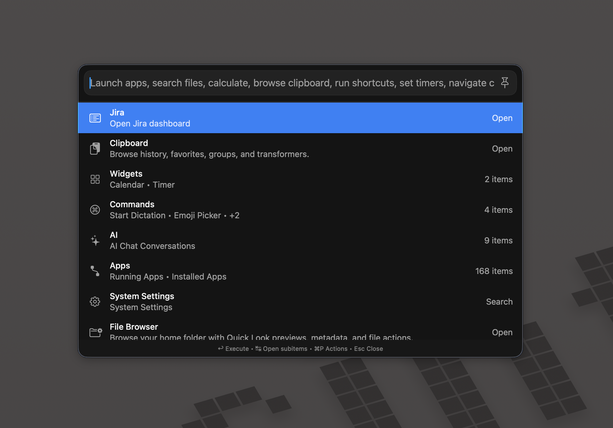
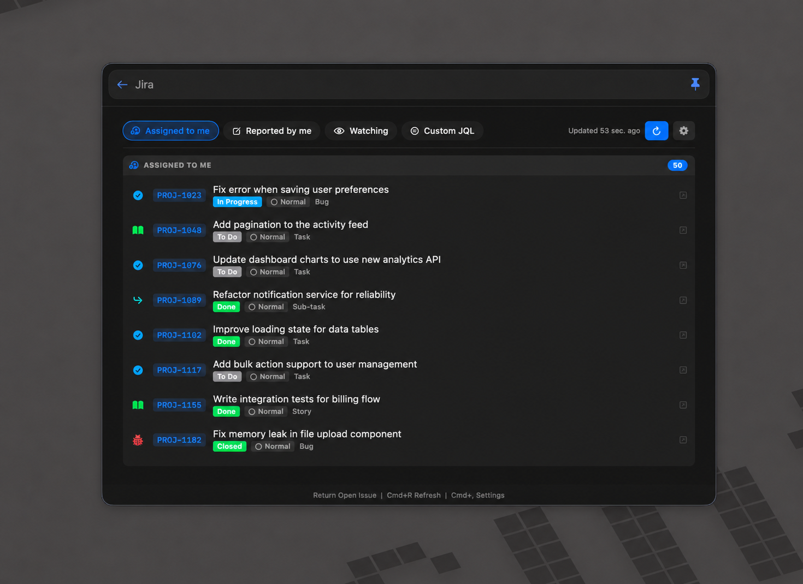
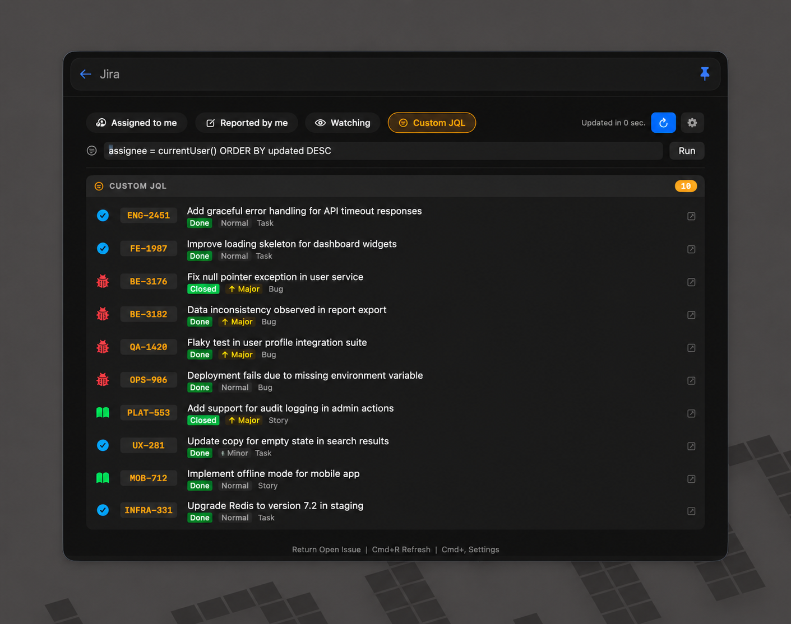
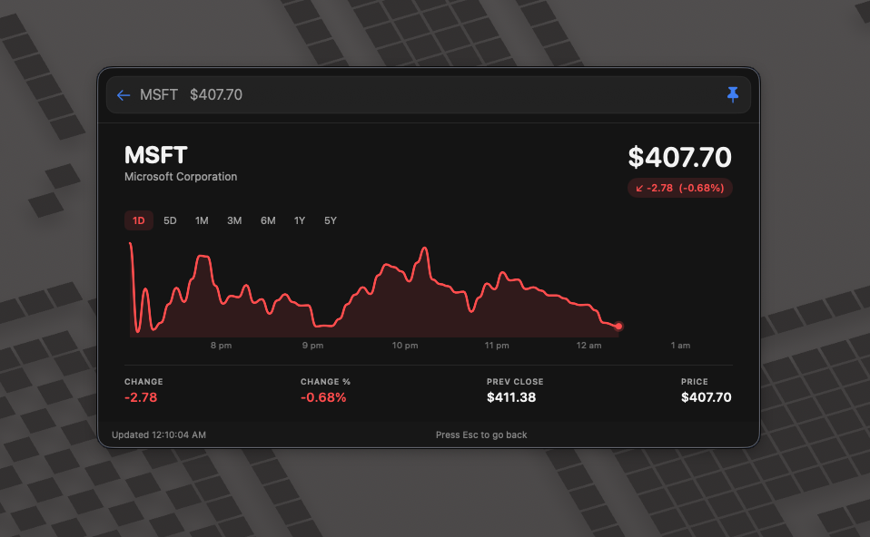
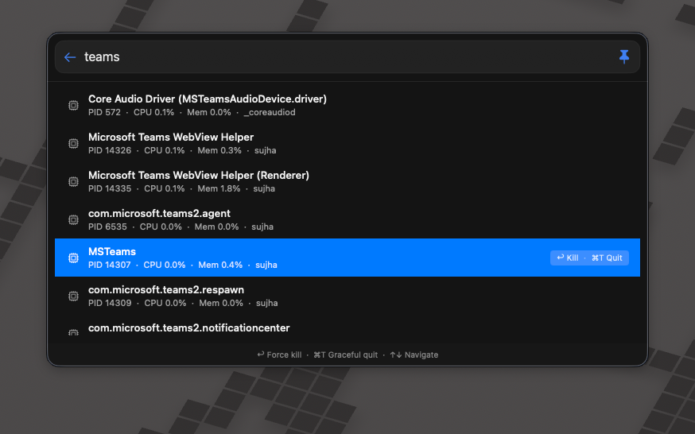
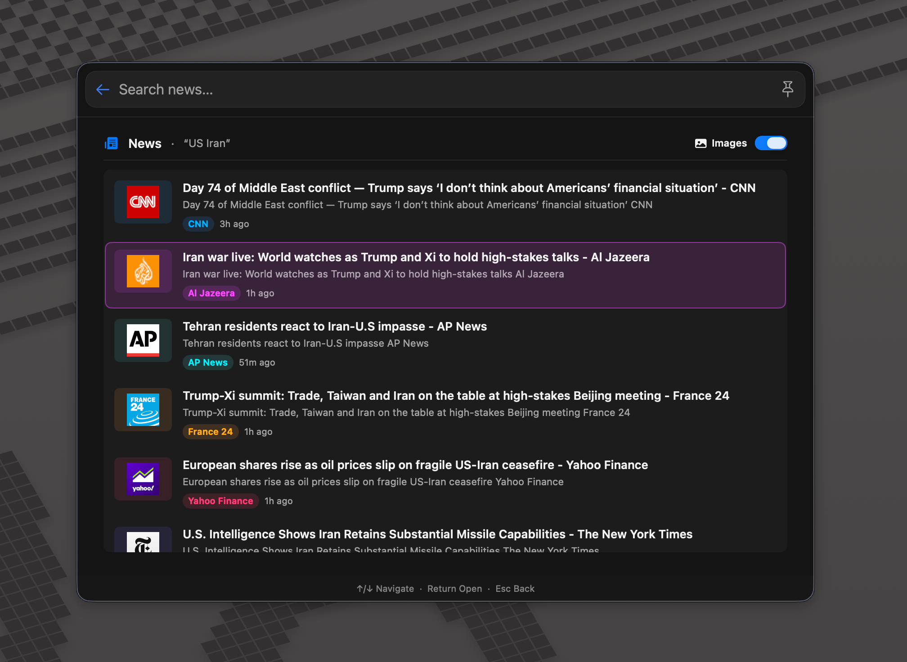

# BetterTouchTool Plugins

A personal collection of [BetterTouchTool](https://folivora.ai) plugins written
in Swift. Most are **Launcher** plugins that hook into BTT's universal launcher
surface; one is an **Action** plugin invoked from triggers.

All plugins are AI-managed sources — edit the `.swift` file in this repo and
BTT recompiles the corresponding `.btt*plugin` bundle on disk automatically.

---

## Plugins

| Plugin | Type | What it does |
| --- | --- | --- |
| [Jira Issues](#jira-issues) | Launcher | Browse issues assigned to / reported by / watched by you, or run any JQL |
| [GitHub PR Monitor](#github-pr-monitor) | Launcher | Lists open PRs and review requests for a fixed GitHub repo |
| [Quick Links](#quick-links) | Launcher | Save reusable URL / path templates and open them with the right app |
| [Stock Prices](#stock-prices) | Launcher | Quote lookup with sparkline + change/period stats |
| [Kill Process](#kill-process) | Launcher | Browse running processes and kill / graceful-quit them |
| [QuickTime Recording](#quicktime-recording) | Launcher | Start a QuickTime screen / audio / movie recording |
| [News Search](#news-search) | Launcher | Search top news articles from the web with a rich preview surface |
| [Cursor Launcher](#cursor-launcher) | Launcher | Quick-open recent Cursor workspaces |
| [VS Code Launcher](#vs-code-launcher) | Launcher | Quick-open recent VS Code workspaces |
| [Xcode Recent Projects](#xcode-recent-projects) | Launcher | Quick-open recently used Xcode projects and workspaces |
| [Copy Path / URL](#copy-path--url) | Action | Copies the front app's document path or the active browser tab's URL |

All launcher plugins surface as a single entry in BTT's universal launcher:



---

### Jira Issues

Browse and search your Jira issues without leaving the launcher.

- Four built-in tabs: **Assigned to me**, **Reported by me**, **Watching**, **Custom JQL**
- Inline filter — just start typing in the launcher search box; the list narrows live across key, summary, status, and type
- ↑/↓ to navigate, **Return** to open in browser
- `⌘R` Refresh · `⌘,` Settings · `⌘U` Copy URL · `⌘K` Copy key
- Surface size is remembered across invocations
- Auth via Jira Personal Access Token (set in the in-app Settings popover or via the `JIRA_TOKEN` env var)




Source: [JiraLauncherPlugin.swift](JiraLauncherPlugin.swift)

---

### GitHub PR Monitor

At-a-glance view of your open pull requests and review requests on a specific
repo. Set the target repo from the in-surface **Settings** popover (gear icon
in the toolbar, or ⌘,). The value is stored in `UserDefaults` under
`com.bttuserplugin.github.prmonitor.repo`.

- Two sections: **My Open PRs** and **Review Requested**
- Type in the launcher search box to filter by title / number / author
- ↑/↓ to navigate, **Return** to open the PR
- Uses the `gh` CLI under the hood, so it inherits your existing auth
- Surface size is remembered across invocations


Source: [GitHubPRMonitor.swift](GitHubPRMonitor.swift)

---

### Quick Links

Save reusable URL or filesystem-path templates as launcher items, each with
its own icon, keywords, and "Open With" target.

- **Create Quick Link** entry in the launcher opens the editor surface
- The Link field auto-fills from the clipboard when it contains a URL
  (any scheme), a bare domain (promoted to `https://`), or an absolute /
  `~`-relative path — random text is ignored
- The **Open With** picker is context-aware and only shows apps relevant to
  the link kind:
  - web URL / domain → system default browser, Safari, Chrome, Arc, Dia, Firefox, Brave, Edge
  - image file → Preview (default), Photoshop, Pixelmator, Sketch, Figma, Photos
  - text / code → Cursor, VS Code, Sublime, Xcode, Nova, BBEdit, TextEdit
  - folder → Finder (default), Cursor, VS Code, iTerm, Terminal, Hyper
  - other / custom scheme → system default app
- Templates support `{argument}`, `{clipboard}`, `{finderPath}`, `{finderURL}`, and any BTT variable; `{rawArgument}` skips URL encoding
- Filesystem paths (`/...`, `~/...`, `./...`) are opened via `URL(fileURLWithPath:)` so they hand off to the right app instead of being mangled into a web URL
- **Manage Quick Links** entry lists every saved link as native launcher rows — press `⌘P` on any row to access **Edit**, **Copy Resolved URL**, **Duplicate**, or **Delete**
- Editor surface size is remembered across invocations


Source: [QuickLinkLauncherPlugin.swift](QuickLinkLauncherPlugin.swift)

---

### Stock Prices

A managed stock watchlist with sparkline charts and detail views.

- Single **Stocks** entry in the launcher opens the watchlist surface
- Add/remove tickers inline — the list is persisted across launches (default seed: ADBE, AAPL, GOOGL, MSFT, AMZN, NVDA, TSLA, META)
- **↑ / ↓** to navigate the watchlist, **Return** to open detail, **Esc** to go back (detail → list → close)
- Quick-jump from the main launcher: type a tracked ticker prefix (e.g. `AAP`) to get direct results that open straight into the detail view
- Detail view: range switcher (1D · 5D · 1M · 3M · 6M · 1Y · 5Y), interactive sparkline with hover-to-inspect, range-aware change/change%, plus prev close and current price
- Watchlist + surface sizes are remembered across invocations




Source: [StockPrices.swift](StockPrices.swift)

---

### Kill Process

A lightweight Activity Monitor inside the launcher.

- Lists running processes (via `ps ax`), sorted by CPU descending
- Type in the launcher search box to filter by process name
- Each row shows PID, CPU %, Mem %, and the owning user
- ↑/↓ to navigate, **Return** to force-kill (`SIGKILL`), `⌘T` for a graceful quit (`SIGTERM`)
- Click any row to select it
- Surface size is remembered across invocations



Source: [KillProcess.swift](KillProcess.swift)

---

### QuickTime Recording

Start a new QuickTime recording without hunting through the menu bar.

- Three entries: **Start Screen Recording**, **Start Audio Recording**, **Start Movie Recording**
- Activates QuickTime Player and clicks the matching `File › New … Recording` menu item via System Events
- Uses QuickTime Player's app icon in the launcher

Source: [QuickTimeRecording.swift](QuickTimeRecording.swift)

---

### News Search

Search top news articles from the web without leaving the launcher. Type your
query, activate the **Search news for "..."** entry, and a rich Jira-style
surface opens with the results.

- Live Google News search (titles, source, snippet, relative time)
- Toggle **Images** in the header to show per-source publisher logos; the
  preference is remembered across invocations
- ↑/↓ to navigate, **Return** to open the selected article in the browser
  (closes the launcher automatically)
- Subtle per-row accent colors and source pills for visual variety
- Surface size is remembered across invocations



Source: [NewsSearchPlugin.swift](NewsSearchPlugin.swift)

---

### Cursor Launcher

Lists recent [Cursor](https://cursor.sh) workspaces from the same `Storage.json`
file the editor uses, so the order matches the editor's "Recent" menu. Select
to open in Cursor.

Source: [CursorLauncher.swift](CursorLauncher.swift)

---

### VS Code Launcher

Same as the Cursor launcher, but for Visual Studio Code. Reads from VS Code's
`storage.json` and opens via the `code` CLI.

Source: [VSCodeLauncher.swift](VSCodeLauncher.swift)

---

### Xcode Recent Projects

Searchable list of recently used Xcode projects and workspaces.

- Single **Search Recent Projects** entry in the launcher (uses Xcode's app icon)
- Children sourced from Spotlight metadata (`kMDItemLastUsedDate`), so the order tracks Xcode's own "Open Recent" menu without needing Full Disk Access
- Both `.xcodeproj` and `.xcworkspace` files are included; embedded `project.xcworkspace` packages and `DerivedData/` paths are filtered out
- **Return** opens the project in Xcode, **⌘R** reveals it in Finder

Source: [XcodeRecentProjects.swift](XcodeRecentProjects.swift)

---

### Copy Path / URL

A BTT **Action** (not a launcher) — bind it to a trigger and it copies the
right thing for the front-most app:

- Browsers (Safari, Chrome, Arc, Edge, Brave, Vivaldi, Opera, Firefox, **Dia**, Kagi, …) → current tab URL
- Finder → POSIX path of the selection, or the front Finder window's folder
- Anything else → the front document's path (via AX / AppleScript)

Multiple resolution strategies are tried in order (AppleScript → `AXURL` on the WebArea → address-bar text field → `AXDocument`) and the most specific result wins. This handles SPA navigations (e.g. YouTube videos) where the document URL would otherwise be stale.

Source: [CopyPathAction.swift](CopyPathAction.swift)

---

## Shared UX features

All launcher plugins share a few niceties:

- **Type-anywhere search** — printable keystrokes inside any surface are redirected to the launcher's external search box, so you never need to click it.
- **Keyboard navigation** — ↑/↓ moves the selection, **Return** opens it, **Esc** goes back.
- **Persisted surface size** — resize once and the size sticks across re-invocations (stored in `UserDefaults`).
- **Auto-select first row** — once the async fetch completes, the first row is selected so arrow keys work immediately.

---

## Repo layout

```
.
├── *.swift                            # plugin sources (one file per plugin)
├── *.btt(action|launcher)plugin/      # bundles BTT compiles into (do not edit by hand)
└── docs/screenshots/                  # screenshots used in this README
```

The `// BTT-Plugin-*` comments at the top of each `.swift` file tell BTT how
to build the bundle (name, identifier, type, icon, description).

## Configuration

A few plugins read from environment / `UserDefaults`:

- **Jira Issues** — `JIRA_TOKEN` env var, or set Base URL + PAT in the in-app Settings popover. JQL is also configurable.
- **GitHub PR Monitor** — uses whatever the `gh` CLI is authenticated to. Target repo is configured via the in-surface Settings popover (⌘,).

---

## License

MIT — see [LICENSE](LICENSE).
